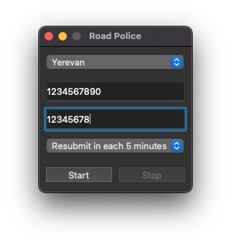
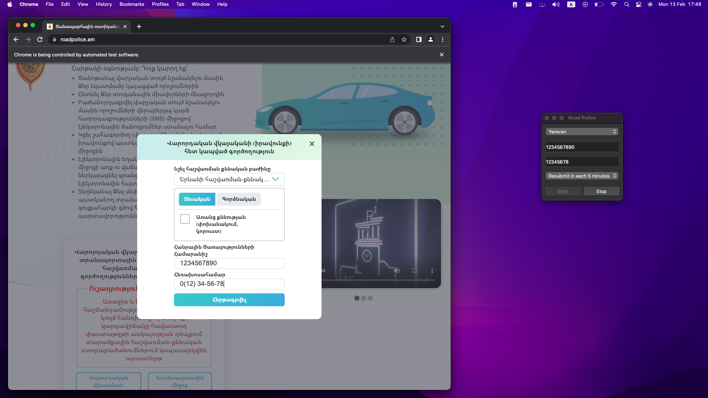

# Applier for Armenian Drivers License

#### Since I couldn't submit to queuing for driver's license activities on "roadpolice.am" website, because the queue of Yerevan was full, I've decided to create a Python macOS App that will try to submit me to queuing automatically, in each some time period.

 

## How to Get and Use the App

* **Step 1:** Clone the repository or download ZIP file and unzip
* **Step 2:** Run "main.app" file which is located in "dist" folder
* **Step 3:** Choose your Prefered City where you want to pass the Driver's License exam
* **Step 4:** Enter your Public Service Number
* **Step 5:** Enter your Phone Number without Country Code (for example: if your Phone Number is +37412345678 then enter 12345678)
* **Step 6:** Choose your Preferred Time Period after which the App will try to resubmit you to queueing and click Start

#### As a result, the App will start trying to submit you to queueing in each chosen time period.
#### The App during work:

#### To stop the continuous submission process just click Stop.
#### **Note:** if the App is trying to submit you to queueing, then the App will finish the trying and only after that will stop the continuous submission process.